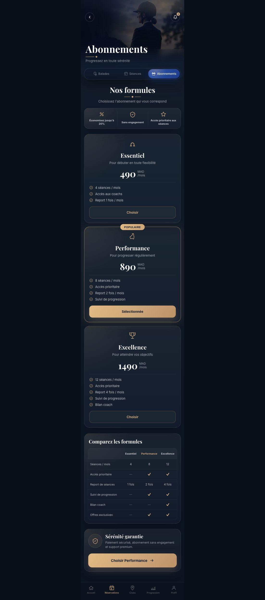

# Equilik Prototype

Prototype mobile premium pour la réservation d'expériences équestres: balades, séances et abonnements.

## Aperçu

| Balades | Séances | Abonnements |
| --- | --- | --- |
|  |  |  |

## Interactions

| Choix du lieu | Calendrier | Filtres Balades | Filtres Séances |
| --- | --- | --- | --- |
|  |  |  |  |

| Offres abonnements | Réservation |
| --- | --- |
|  |  |

## Interfaces

### Balades

Interface de réservation des balades équestres avec hero cinématique, image premium intégrée au fond, choix du lieu de départ, sélection rapide de date et cartes de balades disponibles. Chaque carte affiche l'image réelle, le niveau, la durée, le nombre maximum de cavaliers et le prix.

### Séances

Interface dédiée aux séances encadrées avec les mêmes codes premium: hero immersif, calendrier horizontal, cartes de séances avec horaire, niveau, durée, coach, image de la séance et bouton Réserver. Le bouton ouvre une page de réservation dynamique correspondant à la séance choisie.

### Abonnements

Parcours en deux écrans. La landing Abonnements présente une expérience de club premium avec carte promotionnelle, bénéfices et témoignage. Le bouton Voir les offres ouvre une page dédiée aux formules avec bénéfices, cartes d'abonnement, tableau comparatif, réassurance et CTA de sélection.

### Choix du lieu

Modale centrée avec fond flou, recherche de club ou de ville, suggestions de lieux et bouton de validation. Elle est pensée pour un vrai format mobile: compacte, lisible et immersive.

### Calendrier

Calendrier modal centré avec overlay flouté, sélection de date en mai 2024 et actions Annuler / Confirmer. Le format reste volontairement compact pour ne pas prendre trop d'espace sur l'écran mobile.

### Filtres

Deux bottom sheets premium distincts sont utilisés. Les filtres Balades sont orientés exploration, paysages, type de balade, expérience outdoor, budget et groupe. Les filtres Séances sont orientés entraînement, discipline, niveau technique, créneau horaire, coach, niveau du cheval, disponibilités et tri. Les critères appliqués filtrent réellement les cartes affichées.

### Réservation

Page de réservation premium générée dynamiquement après un clic sur Réserver ou Choisir. Elle reprend l'image de l'activité, le titre, le niveau, la durée, le coach, le prix, les détails modifiables, le nombre de participants, les informations client, les notes optionnelles, le total et le bouton de confirmation.

## Fonctionnalités

- Hero premium avec images équestres réelles et overlays cinématiques.
- Onglets Balades, Séances et Abonnements.
- Saisie interactive du lieu de départ.
- Calendrier modal centré avec fond flou.
- Filtres premium en bottom sheet avec options interactives.
- Page de réservation premium dynamique selon la balade, la séance ou l'abonnement choisi.
- Cartes de balades et séances avec images, prix et détails.
- Parcours Abonnements en deux écrans: landing immersive puis page offres.

## Lancer le projet

```bash
npm install
npm run dev
```

## Build

```bash
npm run build
```
